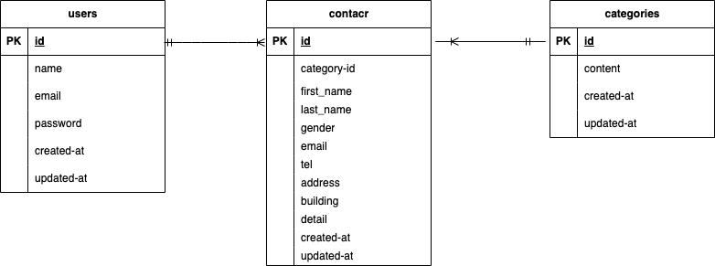

#ContactFormApp

##環境構築
1.Docker の設定
docker-compose up -d --build
2.composer でパッケージをインストール
docker-compose exec php bash
composer install 3. .env ファイルの作成
cp .env.example .env 4.アプリケーションキーを生成
php artisan key:generate 5. .env ファイルの編集 6. php artisan migrate
7.php artisan db::seed

##使用技術
•Lareavel Framework8.83.8
•PHP8.1.33
•HTML/CSS/JS
•MySql:8.0.26
•phpMyAdmin
•Nginx:1.21.1

##ER 図

##URL
•環境開発　 http://localhost/
•phpMyadmin http://localhost:8080
